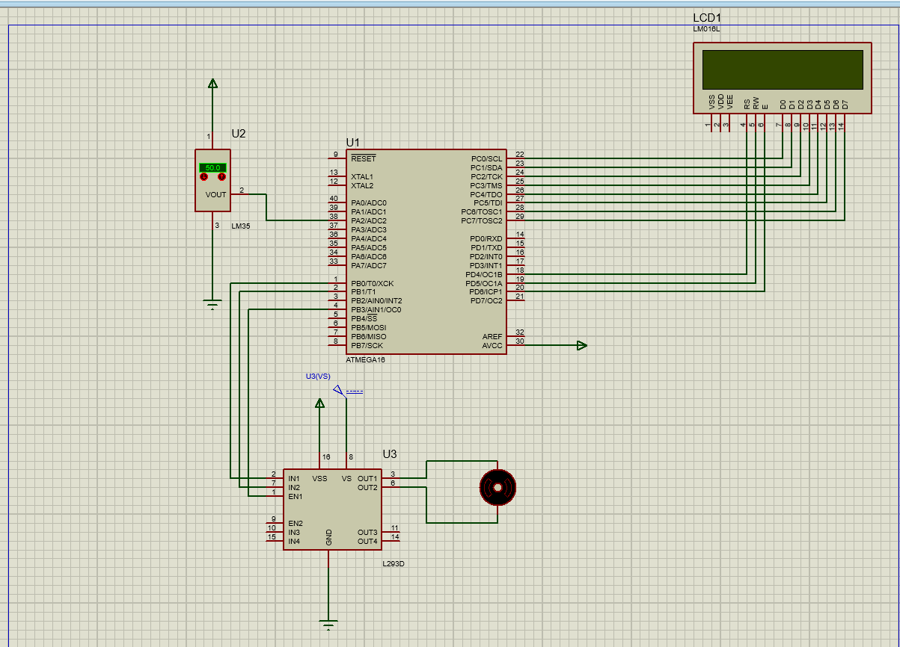

# Temperature Controlled Fan

Embedded System Application Based on C.

## Description

 Embedded System Application in which the fan is automatically turned ON or OFF according to the temperature.

 ***Feature***

1. GPIO  
2. ADC
3. PWM
4. LM35 Sensor
5. LCD
6. DC-Motor
7. Microcontroller: ATMega16

## Getting Started

### Dependencies

* C
* AVR Microcontroller (ATMega16)
* Proteus Software 

### Installing

```
git clone https://github.com/ZiadSheriif/Fan-Controller.git 
```
### Executing program

```
open FanController.elf in Fan.pdsprj
```
```
run Fan.pdsprj
```

### Screenshots



#### Demo Video
<!--  -->

### Contributors

<table>
<tr>
<td align="center">
<a href="https://github.com/ZiadSheriif" target="_black">
<br /><sub><b>ZiadSherif</b></sub></a><br />
</td>
</tr>
 </table>

## License <a name="license"></a>

> This software is licensed under MIT License,
> See [License](https://github.com/ZiadSheriif/Fan-Controller/blob/master/license) for more information ©ZiadSheriif.
